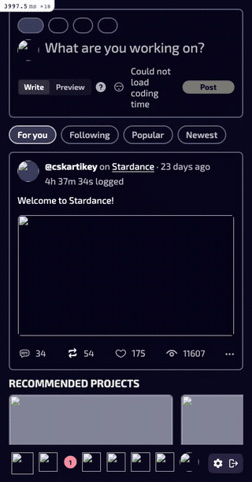

# Feed performance: benchmark, findings, and fixes

This documents a data-driven pass over the main Stardance user flows (feed,
scrolling, liking, commenting), measured on **both the server side** (render
time, SQL) and the **client side** (Core Web Vitals, bundle weight, scroll
FPS), the performance problems found, and the fixes applied in this PR.

## Method

- **Data:** a mirror of the production database (≈30k users, 14.4k posts, 12.2k
  devlogs, 24.7k projects) restored locally, so query plans and association
  fan-out match real-world cardinality rather than a handful of fixtures.
- **User:** signed in as the most active account (147 posts) so the feed is fully
  populated and worst-case for per-item work.
- **Server measurement:** each endpoint hit 6× warm; numbers are the **median**
  of the Rails `Completed … (Views | ActiveRecord | N queries)` log line. Query
  call sites were attributed via `ActiveRecord` backtrace logging (`↳ file:line`).
- **Client measurement:** headless Chromium (Playwright) driving the real `/home`
  feed UX, 6 runs, medians. Core Web Vitals via `PerformanceObserver`
  (paint / `largest-contentful-paint` / `layout-shift` / `longtask`); scroll FPS
  from `requestAnimationFrame` frame intervals while scrolling through the lazy
  pagination. Caveat: only DB rows were mirrored, not Active Storage blob files,
  so post media 404s locally — client numbers reflect document + JS + CSS +
  layout cost, not image download.

All timings are local (DB round-trips ≈0.5 ms). The **query-count** reductions
are the headline: in production each eliminated query is a network round-trip to
the database, so the wall-clock win there is proportionally larger than shown.

## Flows benchmarked

| Flow | Route | Notes |
|------|-------|-------|
| Feed — "For you" (page 1) | `GET /home/feed` | Default tab; Gorse recs + SQL backfill, 20 posts |
| Feed — scroll (page 2) | `GET /home/feed?page=2` | Lazy Turbo-Frame pagination fires this per page |
| Like / unlike | `POST/DELETE /devlogs/:id/like` | `counter_cache` + single Turbo Stream partial |
| Comment | `POST /devlogs/:id/comments` | `counter_cache` + single Turbo Stream partial |

Like and comment are already cheap: both are backed by `counter_cache` columns
(`likes_count`, `comments_count`) and render one Turbo Stream partial, so they do
no per-feed-item work. The feed render is where the cost — and the bugs — were.

## Problems found

The feed render fired **61 SQL queries** for 20 posts. Two of them were N+1s
hiding behind an otherwise-correct preload pass (`preload_feed_associations`):

### 1. Per-card author lookup in `Post::DevlogPolicy#owns?` — ~15 queries

The card component asks `policy(devlog).edit?`/`.destroy?` for every devlog to
decide whether to show the edit/delete controls. `owns?` compared
`post.user == user`, which **loads each post's author** even though the policy
only needs identity:

```
User Load  SELECT "users".* FROM "users" WHERE "users"."id" = 16316 LIMIT 1
  ↳ app/policies/post/devlog_policy.rb:42
... (repeated once per card)
```

**Fix:** compare foreign keys instead of materializing the association —
`post.user_id == user.id`. Zero queries, identical result.

### 2. Per-post `postable` load in `Home::FeedsController#compose_feed` — 20 queries

`compose_feed` iterates the SQL backfill and calls `post.postable.present?` on
each candidate to filter out orphaned/invisible posts. Because this ran *before*
`preload_feed_associations`, it loaded each devlog one row at a time:

```
Post::Devlog Load  SELECT … FROM "post_devlogs" WHERE … "id" = 1 LIMIT 1
  ↳ app/controllers/home/feeds_controller.rb:121
... (repeated once per candidate)
```

**Fix:** materialize the backfill and `preload(backfill_posts, :postable)` once
before the filter loop. The later deep preload descends from the already-loaded
postables, so nothing is loaded twice.

### Query attribution — before vs after (feed page 1)

| Call site | Before | After |
|-----------|-------:|------:|
| `devlog_policy.rb:42` (`owns?` author load) | ~15 | **0** |
| `compose_feed` postable load | 20 | **1** (batched) |
| everything else (feed CTE, preloads, likes/reposts, flipper, shelf) | ~26 | ~20 |
| **total** | **61** | **21** |

## Results

| Flow | Before (median) | After (median) | Δ |
|------|----------------:|---------------:|---|
| Feed page 1 — total | 288 ms | **184 ms** | **−36 %** |
| Feed page 1 — queries | 61 | **21** | **−66 %** |
| Feed page 2 (scroll) — total | 195 ms | **142 ms** | **−27 %** |
| Feed page 2 (scroll) — queries | 56 | **16** | **−71 %** |

Because infinite scroll re-runs the feed query per page, the per-page query
savings compound across a scrolling session.

### Before / after

Same flow (load feed → scroll), recorded against the prod mirror. Post media is
intentionally not loaded (only DB rows were mirrored, not blob files) so the clip
reflects server-render time, not image download.

| Before | After |
|--------|-------|
|  |  |

## Frontend (client-side) performance

Measured in the browser on `/home`, the real feed UX (styled shell that
lazy-loads the feed Turbo Frame). 6 runs, medians.

### Core Web Vitals — healthy

| Metric | After | Verdict |
|--------|------:|---------|
| TTFB | 292 ms | good |
| First Contentful Paint | 320 ms | good (< 1.8 s) |
| Largest Contentful Paint | 320 ms | good (< 2.5 s) |
| Cumulative Layout Shift | 0.088 | good (< 0.1), but see below |
| Total Blocking Time | 0 ms (0 long tasks) | good |
| DOMContentLoaded / load | 315 ms / 682 ms | — |

### Scroll performance — smooth

Scrolling through the feed (which fires the lazy Turbo-Frame pagination) holds
frame rate with no jank:

| Metric | After |
|--------|------:|
| Average FPS | ~83 |
| Average frame time | 12 ms |
| Janky frames (> 50 ms) | **0** |
| Worst frame | 28 ms |
| Long tasks during scroll | **0** |

### Effect of the backend fix on the client

The N+1 fix is server-side, but server time is on the critical path to paint, so
client vitals move with it (small locally where the DB is ≈0.5 ms/query; larger
in production):

| Metric | Before | After |
|--------|-------:|------:|
| TTFB | 301 ms | 292 ms |
| FCP / LCP | 330 ms | 320 ms |

JS/CSS bundle bytes are unchanged by the fix, as expected.

### Page weight — the real frontend opportunity

| Asset | Decoded size | Notes |
|-------|-------------:|-------|
| `/home/feed` document | ~450 KB | uncompressed in dev; gzip in prod ≈ 1/8th. ~22 KB of HTML per post |
| JavaScript | ~2.1 MB (4 files) | decoded/parsed bytes; ~89 KB over the wire |
| CSS | ~600 KB | decoded; ~17 KB over the wire |

These don't block paint on a fast machine (TBT 0), but the ~2.1 MB of parsed JS
and ~22 KB HTML/post are what would hurt on low-end mobile and are the main
client-side headroom.

### CLS source

CLS (0.088) does **not** come from feed images — the media containers already
reserve space via `aspect-ratio` (`_feed.scss`). The recorded shift sources are
the composer toolbar and feed tabs reflowing as JS hydrates (~5 s):
`feed-composer__toolbar`, `md-tabs`, `feed-composer__emoji-wrap`. It's under the
0.1 "good" threshold; reserving a min-height on the composer toolbar would
shave it further (left out here — visual change, separate from the N+1 fix).

## Further opportunities (not in this PR)

Documented for follow-up; left out here to keep the change small and
migration-free:

- **Recommended-projects shelf** (`Feed::ShelfComponent` →
  `recommendable_scope.with_banner_priority`) is the slowest *single* query
  (~25 ms): a `NOT IN (subquery)` + Active Storage join + `ORDER BY
  attachments.id IS NULL`. A partial index / rewrite would help.
- **Feed ranking CTE** (`Gorse::PostPayload.feed_scope`) is ~52 ms — the
  irreducible core query; worth an index review on the `quality_latest` ordering
  columns.
- **JS bundle** (~2.1 MB parsed across 4 files): a code-split / import audit
  would cut parse time on low-end mobile.
- **Feed HTML weight** (~22 KB/post uncompressed): trimming per-card markup or
  deferring offscreen cards would shrink the initial document.
- **CLS from composer hydration** (~0.05 of the 0.088): reserve a min-height on
  the composer toolbar so tabs/feed don't jump when JS hydrates.
